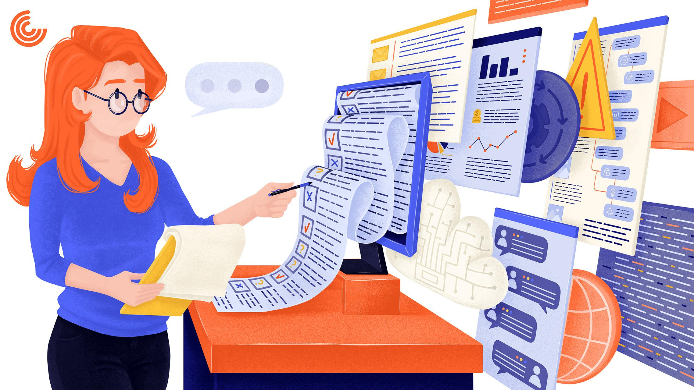

# What is S.R.S?

&#x20;by its acronym with the meaning of:

A software requirements specification, It is basically a document that describes what the software will do and how it is expected to work. This includes the requirements you need to meet the needs of all interested parties.

<figure><figcaption></figcaption></figure>

### Characteristics of S.R.S:

* Unambiguos
* Complete
* Verifiable
* Modifiable
* Traceable
* Useable during the operation and maintenance phase&#x20;

### Detailed explanation of the characteristics:

| Without ambiguity.                                                                                                                               | Complete                                                                                                                                                                                              | verifiable                                                                                                                                                                                                                                                               | Consistent                                                                                                                                                                                                                       |
| ------------------------------------------------------------------------------------------------------------------------------------------------ | ----------------------------------------------------------------------------------------------------------------------------------------------------------------------------------------------------- | ------------------------------------------------------------------------------------------------------------------------------------------------------------------------------------------------------------------------------------------------------------------------ | -------------------------------------------------------------------------------------------------------------------------------------------------------------------------------------------------------------------------------- |
| At a minimum, this requires that each feature of the final product be described using a single term.                                             | Inclusion of all significant requirements, whether related to functionality, performance, design constraints, attributes, or external interrelationships.                                             | An SRS is verifiable if, and only if, all the requirements stated in it are verifiable. A requirement is verifiable if and only if there is some finite, cost-effective process by which a person or machine can verify that the software product meets the requirement. | A good SRS is consistent if and only if no set of individual requirements described in it conflict. There are three main types of conflicts in an SRS:                                                                           |
| In cases where a term used in a particular context may have multiple meanings, the term should be included in a glossary specifying its meaning. | Defining the software responses to all realizable classes of input data in all realizable classes of situations. Note that it is important to specify the response to valid and invalid input values. |                                                                                                                                                                                                                                                                          | Two or more requirements may describe the same real-world object, but use different terms for that object. For example, a program's request for user input might be called a “prompt” in one requirement and a “cue” in another. |
|                                                                                                                                                  | Compliance with any applicable SRS standard. If a particular section of the standard is not applicable, the SRS must include the section number and an explanation of why it is not applicable.       |                                                                                                                                                                                                                                                                          |                                                                                                                                                                                                                                  |

### Benefits to write a S.R.S&#x20;

In addition to providing the foundation for successful product development by creating alignment between customers and suppliers and keeping everyone involved on the same page, an SRS offers a number of other benefits that make it well worth the effort required. to write it.

According to Rideau developer Kurosh Farsimadan, “The use of the SRS can eliminate and prevent errors in the design phase, as any conflicting requirements and features that need validation can be corrected at this point and stakeholders can be contacted for re-evaluation.”

It is always significantly less expensive to make changes early in the software development process than later, when countless hours and a great deal of energy and resources have already been expended. Having a well-written SRS helps streamline the development process by avoiding duplication of tasks and structuring problems so that they are easily solvable.

All other documentation, both technical and commercial, can be based on the SRS to ensure consistency and accuracy.

### Why is it important to define and document the software requirements specification?

There are many horror stories about software developers and customers clashing with project requirements, and one of the most common causes of such disputes is ambiguous language.

Vague terms like "urgent", "pending", "as soon as possible", etc., can mean something different to the customer and the development company or between the user and the development group.

Or, perhaps the parties involved have a different impression of the priority functionalities of the product. It's not the fault of either party, per se, they're just speaking different languages, in a sense.

The customer has an idea of the product, its features, and what the user interface might look like. But developers are usually thinking about "behind the scenes" of the project, how to write scalable and readable code, ensure security, make a solution work, minimize bugs, etc.

<figure><figcaption></figcaption></figure>
